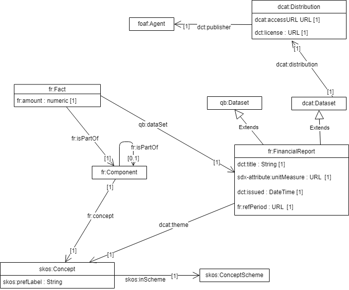
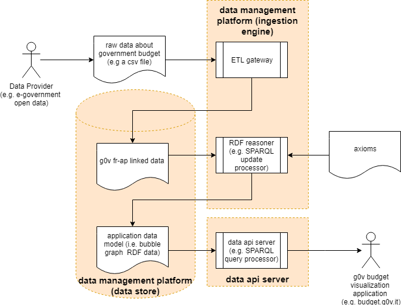

g0v fr-ap: a financial report application profile
=================================================

g0v fr-ap  is a specification based on [Finacial Report Vocabulary](http://linkeddata.center/botk-fr/v1) suitable to annotate government data 
with the purpose of supporting budget visualization applications (e.g. http://budget.g0v.it/).  

It captures different perspectives of a government budget data like historical trends, cross-department and component breakdown of tax by government. 

g0v fr-ap is a semantic web application that builds upon the following RDF vocabularies:: 

- the [W3C RDF Data Cube Vocabulary](https://www.w3.org/TR/vocab-data-cube), to describe the outgoings/incomes accounts observations
- the [Financial Report Vocabulary](http://linkeddata.center/botk-fr/v1) that extends the Data Cube Vocabulary with classes, attributes and bindings about a generic Financtial reports.
- the [Data Catalog Vocabulary](https://www.w3.org/TR/vocab-dcat/) to describe the dataset metadata
- the [SKOS](https://www.w3.org/TR/skos-primer) to describe balance taxonomy.
- the [DCMI Metadata Terms](http://dublincore.org/documents/dcmi-terms/)
- some facilities from [sdmx ontologies](https://sdmx.org/)

g0v fr-ap also reuses some individual references to linked open data provided by [UK e-gov](https://github.com/alphagov/datagovuk_reference) and by 
[Currency EU vocabulary](http://publications.europa.eu/resource/authority/currency).

This picture summarize the g0v fr-ap restrictions:




In this snippet (in RDF turtle format) describes a provisional financial report as linked data with FR:

```
@prefix fr: <http://linkeddata.center/botk-fr/v1#>.
@prefix kees: <http://linkeddata.center/kees/v1#> .
@prefix skos: <http://www.w3.org/2004/02/skos/core#> .
@prefix dct:  <http://purl.org/dc/terms/> .
@prefix daq: <http://purl.org/eis/vocab/daq#>.
@prefix interval: <http://reference.data.gov.uk/def/intervals/> .
@prefix qb:       <http://purl.org/linked-data/cube#> .
@prefix : <#>.

:2018_budget_report a fr:FinancialReport ;
	dcat:theme <https://it.dbpedia.org/resource/Bilancio_dello_Stato> ;
	fr:refPeriod <http://reference.data.gov.uk/id/gregorian-interval/2018-01-01T00:00:00/P1Y> ;
	fr:unit <http://publications.europa.eu/resource/authority/currency/EUR> .
	
:facx_x a fr:Fact;
	fr:concept :level_5_account_02001200010001 ;
	qb:dataSet :2018_budget_report ;
	fr:amount 288149000000.00	.

:facx_y a fr:Fact;
	fr:concept :level_5_account_02001200020001 ;
	qb:dataSet :2018_budget_report ;
	fr:amount 881493000.00	.
	
:level_5_account_A102001200010001 a skos:Concept ;skos:broader :level_4_account_A10200120001 .
:level_5_account_A102001200020001 a skos:Concept ;skos:broader :level_4_account_A10200120002 .
:level_4_account_A10200120001 a skos:Concept ; skos:broader :level_3_account_A1020012 .
:level_3_account_A1020012 a skos:Concept ; skos:broader :level_2_account_A102 .
::level_2_account_A102 a skos:Concept ; skos:broader :top_level_account_A1 .
:top_level_account_A1 a skos:Concept .
:budget_taxonomy a skos:ConceptScheme; skos:hasTopConcept :top_level_account_A1 .

```

A reasoner that is able to understand SKOS and FR axioms is able to generate CUBE canonical observations e.g:

```
:facx_x a fr:Fact, qb:Observable;
	fr:concept :level_5_account_02001200010001 ;
	qb:dataSet :2018_budget_report ;
	fr:refPeriod <http://reference.data.gov.uk/id/gregorian-interval/2018-01-01T00:00:00/P1Y> ;
	fr:unit <http://publications.europa.eu/resource/authority/currency/EUR> ;
	fr:isPartOf :component_z ;
	fr:amount 288149000000.00	.

:component_z a fr:Component;
    fr:concept :level_4_account_A10200120001;
    fr:hasPart :facx_x;
    fr:isPartOf :component_k.
    
:level_4_account_A10200120001 a skos:Concept ; 
    skos:broader :level_3_account_A1020012 ;
    skos:narrower 
        :level_5_account_A102001200010001,
        :level_5_account_A102001200020001 .

...

```


The directory [examples](examples/README.ttl) provides some data and axioms ready to use in a RDF store with a SPARQL update and query capabilities.

## How to use FR

If you want to write an application that analyzes/visualizes budget data, first you have to transform the government budget raw data in RDF linked 
data according to fr-ap classes and properties. 

With SPARQL update you can also easily write rules to model the  financial data as requested BY the visualization tool (for example a bubble graph).
The application data model can queried using the [SPARQL language](http://www.w3.org/TR/sparql11-query/).

In this picture shows the typical workflow:



