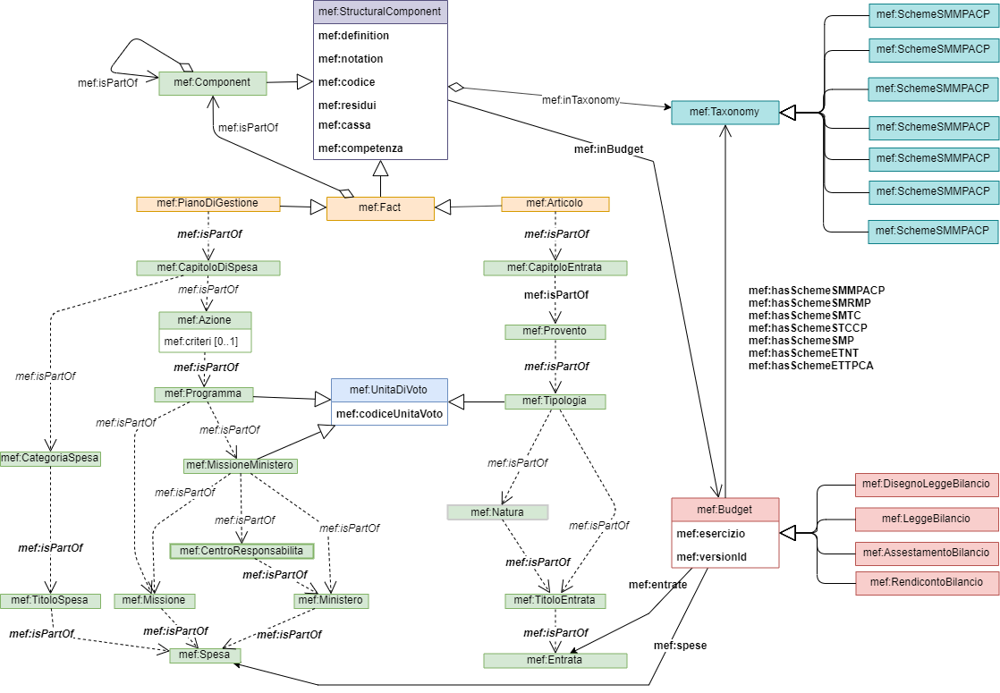

g0v mef ontology
==============

Status: **unstable**

The [Italian budget](https://openbdap.mef.gov.it/it/BdS) is a set of living financial reports defined by the Economy and Finance Administration of the Italian Government (i.e. *Ministero dell'Economia e delle Finance* - **MEF**).

The *g0v mef ontology* is a conceptual model developed by the [g0v.it civic hacking team](https://g0v.it)
to represent the Italian budget and its its historical perspective;
*g0v mef ontology*  defines the sets of things that are of interest in describing the MEF world, and the ways that those things can relate to one another. 

In this way, *g0v mef ontology* adds formal meaning to the raw data that are published in the [BDAP Open Data Catalog](https://bdap-opendata.mef.gov.it/catalog) by MEF.

## Accessing g0v mef ontology

*g0v mef ontology* is technically expressed in the RDF/OWL - the language of the World Wide Web for machine readable inference processing. 
It is very expressive and linguistically aligned with how people think and speak - but expressed in a way that machines can process 
based on mathematical formulas and description logic. By taking advantage of the RDF/OWL Web standard, *g0v mef ontology* uses machine 
intelligence and network graph capabilities to express, enrich, classify and link data in ways that were not previously possible.

The RDF/OWL file can be embedded in computer applications that can perform logic functions such as inferring classifications and relationships.

You can access this ontology by:
 
- editing the *g0v mef ontology* [RDF source file](mef.rdf) serialized using XML RDF notation. 
- navigate the *g0v mef ontology* with [WebOwl](http://visualdataweb.de/webvowl/#iri=http://w3id.org/g0v/it/mef)
- browse the html document generated by [LODE](http://150.146.207.114/lode/extract?url=http://w3id.org/g0v/it/mef)
- edit *g0v mef ontology* with [Standford University Protégeè](https://protege.stanford.edu/)

 
## The mef vocabulary

The mef Vocabulary extends the [Financial Report](http://linkeddata.center/botk-fr/v1) and the [SKOS](http://www.w3.org/2004/02/skos/core)

The namespace for *g0v mef ontology* is *http://w3id.org/g0v/it/mef#* and the suggested prefix is *mef:*

The class **mef:Budget** describes the Italian Budget Report as a subclass of the [fr:FinancialReport](http://linkeddata.center/botk-fr/v1#FinancialReport) and should be related (dct:source) with some documents described with [DCAT](https://www.dati.gov.it/content/dcat-ap-it-v10-profilo-italiano-dcat-ap-0) (according with DCAT-AP_IT v1.0 profile) vocabulary.

### Budget life cycle

The Italian budget (mef:Budget) exists in four states:

- *Disegno di Legge di Bilancio* (mef:DisegnoLeggeBilancio): published yearly by the Italian government (usually at the beginning of November) and presented to the Italian Parliament and to the EU commission for approval.
- *Legge di Bilancio* (mef:LeggeBilancio): approved by the Italian Parliament usually before the end of the year
- *Previsioni di Assestamento di Bilancio (mef:AssestamentoBilancio)*: approved by the Italian Parliament usually at the mid of the year
- *Rendiconto* (mef:Rendiconto): approved by the Italian Parliament as a consolidated view of the budget data

In each state more than one release can be published.

To capture this life cycle, fr:versionId uses the convention {YEAR}{REPORT VERSIONID}{REVISION ID}:

- {YEAR} refers to the reference year of the financial document,
- {REPORT TYPE} refers to the main budget state: 
    - **A** means *Disegno di Legge di Bilancio*, 
    - **B** means *Legge di Bilancio*,  
    - **C** means *Previsioni di assestamento*, 
    - **D** means *Rendiconto Bilancio*
- {REVISION ID} is an optional non negative integer representing a specific budget release.

some axioms apply:
- the budget subtype can be inferred by the {REPORT TYPE} part in fr:versionId.
- the budget fr:referencePeriod can be inferred by the {YEAR} part in fr:versionId.

e.g.:

- *2020A* means the last release of the *Disegno di Legge di Bilancio* relative to 2020 year
- *2019B* means the release of *Legge di Bilancio* relative to 2019 year as approved by the Italian Parliament in Dec. 2018
- *2018D* means Rendiconto* of 2018 year as approved by the Italian Parliament in 2019
- *2020A20191105* means *Disegno di Legge di Bilancio* relative to 2020 year as approved by the Italian Parliament the 05/11/2019

### Taxonomies

The budget report is made by facts (mef:Fact) that are aggregated in components (mef:Components)

All components and facts concepts relate (skos:inScheme) to one or more classification scheme (i.e.taxonomies):

- taxonomies related to expenses (S):
    - mef:hasSchemeSMMPACP (**Ministero->Missione->Programma->Azione->Capitolo di spesa->Piano di gestione**)
    - mef:hasSchemeSMRMP (**Ministero->Centro di responsabilità->Missione->Programma**)
    - mef:hasSchemeSMTC (**Ministero->Titolo spesa->Categoria**)
    - mef:hasSchemeSTCCP (**Titolo di spesa->Categoria->Capitolo->Piano di gestione**)
    - mef:hasSchemeSMP (**Missione->Programma**)
- taxonomies related to incomings (E):	
    - mef:hasSchemeETNT (**Titolo entrata->Natura->Tipologia**)
    - mef:hasSchemeETTPCA (**Titolo entrata->Tipologia->Provento->Capitolo->Articolo**)
    

### Axioms & Mappings

*g0v mef ontology* axioms and mappings with other ontologies are formally expressed as SPARQL constructs in the [axioms directory](axioms). 
Here is a short index:

- [axiom 1](axioms/01-metrics.construct):*mef:StructuralComponents* is an extension of fr:StructuralComponents that exports three distinct metrics : the *mef:competenza*, *mef:cassa* and *mef:residui* that are monetary metrics always expressed in EURO; 
the value of the component metrics is computed as the sum of the  facts.
- [axiom 2](axioms/02-one-year-as-reference-period.construct): *fr:refPeriod* refers always to a full solar year period;
- [axiom 3](axioms/03-taxonomies.construct): all mef:StructuralComponents are skos:Concept related (skos:inScheme) to one or more taxonomies (skos:Scheme) exposed by *mef:Budget*;
- [axiom 4](axioms/04-partof.construct):*fr:isPartOf* should be considered as a sub-property of skos:broader with inverse skos:narrower;
- [axiom 5](axioms/05-versioning.construct): components in different budgets with the same skos:notation should be considered related with skos:closeConcept properties and version related (dct:has version and dct:isVersionOf) taking into consideration the reference the version label.

### Datatypes

Following String datatype are defined:

| datatype              | regexp                        | on property  |
|-----------------------|-------------------------------|--------------|
| mef:BudgetVersion     | `^(20\d{2})([A-D])(\d*)$`     | fr:versionId |

